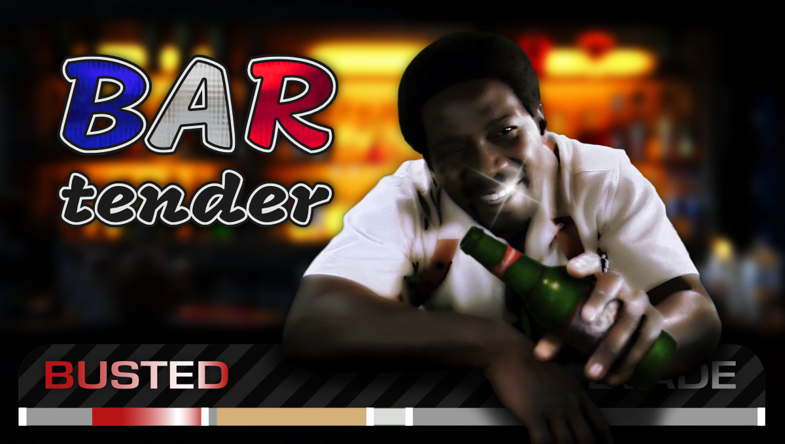

This .asi mod **adds new customisation options to pursuits** in *Need for Speed: Most Wanted* (2005). These options come in two feature sets:
* the **"Basic" feature set** lets you change many otherwise hard-coded values of the game, and
* the **"Advanced" feature set** lets you [change cop-spawning behaviour and tables without limits](https://youtu.be/XwFSpc97hF4).

&nbsp;

This document **answers the following questions** in detail:
1. [What does the "Basic" feature set do?](#1---what-does-the-basic-feature-set-do)
2. [What does the "Advanced" feature set do?](#2---what-does-the-advanced-feature-set-do)
3. [What should I know before I use Bartender?](#3---what-should-i-know-before-i-use-bartender)
4. [How do I install Bartender for my game?](#4---how-do-i-install-bartender-for-my-game)
5. [How may I redistribute or bundle Bartender?](#5---how-may-i-redistribute-or-bundle-bartender)

&nbsp;

&nbsp;

&nbsp;

# 1 - What does the "Basic" feature set do?

This feature set **lets you change** (per Heat level)
* at which distance and how quickly you can get busted,
* how long it takes to fill the "EVADE" bar and enter "COOLDOWN" mode,
* at which time interval you gain passive bounty,
* the maximum combo-bounty multiplier for destroying cops quickly,
* the internal cooldown for regular roadblock spawns,
* the internal cooldown for Heavy and LeaderStrategy spawns,
* which vehicles spawn through HeavyStrategy 3 (the ramming SUVs),
* which vehicles spawn through HeavyStrategy 4 (the roadblock SUVs), and
* which vehicles spawn through LeaderStrategy 5 / 7 (Cross and his henchmen).

&nbsp;

This feature set **fixes four bugs**:
* Heat levels > 5 are no longer reset back to 5 when you enter free-roam or start an event,
* Heat levels > 5 are now shown correctly in menus (requires [Binary](https://github.com/SpeedReflect/Binary/releases) for missing textures),
* you can no longer get busted due to line-of-sight issues while the "EVADE" bar fills, and
* regular roadblock and Heavy / LeaderStrategy spawns no longer slow down in longer pursuits.

&nbsp;

You can also **assign new ([Binary](https://github.com/SpeedReflect/Binary/releases)) strings** for the game to display when cop vehicles are destroyed, similar to the [NFSMW Unlimiter mod](https://github.com/nlgxzef/NFSMWUnlimiter/releases) by nlgxzef. Compared to Unlimiter, this mod's version of this feature is easier to configure, leaner, and even checks strings for correctness on game launch, ignoring any specified strings that do not actually exist in the game's (modified) binary files.

&nbsp;

&nbsp;

&nbsp;

# 2 - What does the "Advanced" feature set do?

This feature set **lets you change** (per Heat level)
* how many cops can (re)spawn without backup once a wave is exhausted,
* the global cop-spawn limit for how many cops in total may chase you at any given time,
* how quickly (if at all) cops flee the pursuit if they do not belong,
* which vehicles (any amount, with counts and chances) may spawn to chase and search for you,
* which vehicles (same liberties as above) may spawn in regular roadblocks,
* which vehicles (ditto) may spawn as pre-generated cops in scripted events,
* which vehicles (without counts) may spawn as free patrols when there is no active pursuit,
* which vehicle spawns in place of the regular helicopter, and
* when exactly (if at all) the helicopter can (de / re)spawn.

&nbsp;

This feature set **also fixes** the displayed engagement count in the centre of the pursuit bar: its value now accurately reflects how many chasing cop spawns remain in the current wave. The count ignores vehicles spawned through any Heavy / LeaderStrategy, the helicopter, and all vehicles that join the pursuit by detaching themselves from roadblocks.

&nbsp;

&nbsp;

&nbsp;

# 3 - What should I know before I use Bartender?

The two feature sets of this mod each come with caveats and limitations. To avoid nasty surprises and game instability, make sure you understand them all before you use this mod in any capacity.

Both feature sets of this mod should be **compatible** with all VltEd, Binary, and most .asi mods. All known and notable exceptions to this are explicitly mentioned in this section.

&nbsp;

&nbsp;

## 3.1 - What should I know about the "Basic" feature set?

**In general**:

* The configuration (.ini) files for this feature set are located in `BartenderSettings/Basic`.

* You can disable any feature of this set by deleting the file containing its parameters, but bug fixes do not have parameters and are implicitly tied to specific files instead.

* Only deleting all configuration files of this feature set disables the two Heat-level fixes.

* The Heat-level reset fix is completely incompatible with the `HeatLevelOverride` feature of the [NFSMW ExtraOptions mod](https://github.com/ExOptsTeam/NFSMWExOpts/releases) by ExOptsTeam. I recommend you disable this ExtraOptions feature in general, as it might also interfere with other Bartender features in subtle ways; to do so, edit ExtraOptions' `NFSMWExtraOptionsSettings.ini` configuration file. Note that you can still change the maximum available Heat level with VltEd: The `0xe8c24416` parameter of a given `race_bin_XY` VltEd entry is what sets the maximum Heat level (1-10) while you are at Blacklist rival #XY.

* If you do not install the optional missing textures (`FixMissingTextures.end`), then the game will not display a number next to Heat gauges in menus for any car with a Heat level above 5. The Heat-level reset fix, on the other hand, will work even without these optional textures.

&nbsp;

Regarding **cop ([Binary](https://github.com/SpeedReflect/Binary/releases)) strings** (`BartenderSettings\Basic\Labels.ini`):

* This feature is completely incompatible with the `EnableCopDestroyedStringHook` feature of the [NFSMW Unlimiter mod](https://github.com/nlgxzef/NFSMWUnlimiter/releases) by nlgxzef. Either delete Bartender's `Labels.ini` configuration file or disable Unlimiter's version of the feature by editing its `NFSMWUnlimiterSettings.ini` file.

&nbsp;

Regarding **ground supports** (`BartenderSettings\Basic\Supports.ini`):

* Deleting this file disables the fix for slower roadblock and Heavy / LeaderStrategy spawns.

* All vehicles you specify to replace the HeavyStrategy 3 spawns (the ramming SUVs) should each have a low `MAXIMUM_AI_SPEED` value (the vanilla SUVs use 50) assigned to them in their `aivehicle` VltEd entries; otherwise, they might cause stability issues by joining the pursuit long-term after their ramming attempt(s), effectively circumventing the global cop-spawn limit.

* All vehicles you specify to replace Cross in LeaderStrategy 5 / 7 should each not be used by any other cop elsewhere. If another cop uses the same vehicle as Cross, no LeaderStrategy will be able to spawn as long as that cop is present in the pursuit.

&nbsp;

Regarding **uncategorised features** (`BartenderSettings\Basic\Others.ini`):

* Deleting this file disables the fix for getting busted while the "EVADE" bar fills.

&nbsp;

&nbsp;

## 3.2 - What should I know about the "Advanced" feature set?

**In general**:

* The configuration (.ini) files for this feature set are located in `BartenderSettings/Advanced`.

* You can disable any feature of this set by deleting the file containing its parameters. This does not apply to the engagement-count fix, which is tied to this entire feature set instead.

* This entire feature set is disabled if *any* free-roam Heat level lacks a valid "Chasers" spawn table (`BartenderSettings\Advanced\Cars.ini`); each table must contain at least one vehicle.

* If this feature set is enabled, the following `pursuitlevels` VltEd parameters are ignored because this feature set fulfils their intended purposes with much greater customisation: `cops`, `HeliFuelTime`, `TimeBetweenHeliActive`, and `SearchModeHeliSpawnChance`.

* In each Heat level's `pursuitsupport` VltEd entry, ensure that every HeavyStrategy enabled is only listed once (e.g. there is not a second HeavyStrategy 3), and that there is no more than one LeaderStrategy enabled; otherwise, their `Duration` VltEd parameters might be misread.

&nbsp;

Regarding **helicopter (de / re)spawning** (`BartenderSettings\Advanced\Helicopter.ini`):

* All vehicles you specify to replace the helicopter must each have the ``CHOPPER`` class assigned to them in their `pvehicle` VltEd entries, either directly or through parent entries.

&nbsp;

Regarding **cop (de / re)spawning** (`BartenderSettings\Advanced\Cars.ini`):

* Until HeavyStrategy 3 and LeaderStrategy spawns have left the pursuit, they can block new "Chasers" from spawning (but not the other way around). This is vanilla behaviour, as these spawns count toward the total number of cops loaded that the global cop-spawn limit (which only affects "Chasers") is compared against. This total is calculated across all active pursuits, meaning cops spawned in NPC pursuits can also affect how many "Chasers" may spawn in yours.
  
* Pushing any global cop-spawn limit beyond 8 requires the [NFSMW LimitAdjuster mod](https://zolika1351.pages.dev/mods/nfsmwlimitadjuster) (LA) by Zolika1351 for stability. Without LA, the game will start unloading models and assets because its default car loader cannot handle the workload of managing (potentially) dozens of vehicles. To fully unlock the global cop-spawn limit without taking spawn control away from Bartender, open LA's `NFSMWLimitAdjuster.ini` configuration file and disable *everything* in its `[Options]` parameter group. LA itself may crash within 30 seconds of the first pursuit per play session.

* All vehicles you specify in any of the spawn tables must each have the `CAR` class assigned to them in their `pvehicle` VltEd entries, either directly or through parent entries.

* All empty "Roadblocks", "Events", and "Patrols" spawn tables for free-roam Heat levels become copies of their respective "Chasers" tables, which must each contain at least one vehicle.

* All empty spawn tables for race Heat levels become copies of their free-roam counterparts.

* Vehicles in "Roadblocks" spawn tables are not equally likely to spawn in every vehicle position of a given roadblock formation. This is because the game processes roadblock vehicles in a fixed, formation-dependent order, making it (e.g.) more likely for vehicles with low `count` and high `chance` values to spawn in any position that happens to be processed first. This does not apply to vehicles with `count` values of at least 5, as no roadblock contains more than 5 cars.

* Rarely, cops that are not in "Roadblocks" spawn tables might still show up in roadblocks. This is a vanilla bug; it usually happens when the game attempts to spawn a "Chaser" while it is processing a roadblock request, causing it to place the wrong car in the requested roadblock. This bug is not restricted to cop spawns: if the stars align, it can even happen with traffic.

* The "Events" spawn tables do *not* apply to the scripted patrols that spawn in any of the prologue D-Day events; those spawns are special and a real hassle to deal with, even among event spawns.

* The "Events" spawn tables do *not* apply to the very first scripted, pre-generated cop that spawns in a given event; instead, this first cop is always of the type listed in the event's `CopSpawnType` VltEd parameter. This is because the game requests this vehicle before it loads any pursuit or Heat-level information, making it impossible for this mod to know which spawn table to use for this one vehicle. This vehicle, however, is still properly accounted for in `count` calculations for any following vehicle spawns.

* `count` values in "Roadblocks" and "Events" spawn tables are ignored whenever the game requests more vehicles in total than these values would allow: When all their `count` values have been exhausted for a given roadblock / event, every vehicle in the relevant table may spawn without restriction until the next roadblock / event begins.

* Making Heat transitions very fast (`0x80deb840` VltEd parameter(s) set to < 5 seconds) can cause a mix of cops from more than one "Events" spawn table to appear in events that feature scripted, pre-generated cops. This happens because, depending on your loading times, the game might update the Heat level as it requests those spawns. If you want to keep fast transitions, you can avoid this issue by setting the event's `ForceHeatLevel` VltEd parameter to the target Heat level.

* Depending on their type, patrol spawns are taken from different spawn tables: Free patrols that spawn when there is no active pursuit are taken from "Patrols" tables, while searching patrols that spawn in pursuits when you are in "COOLDOWN" mode are taken from "Chasers" tables instead. For both types, the `NumPatrolCars` VltEd parameter controls how many cars may spawn at any given time; free patrol spawns ignore the global cop-spawn limit, while searching patrol spawns ignore the remaining engagement count (but not the global limit). This is all vanilla behaviour.

&nbsp;

&nbsp;

&nbsp;

# 4 - How do I install Bartender for my game?

**Before installing** this mod:
1. make sure you have read and understood the ["What should I know...?" section](#3---what-should-i-know-before-i-use-bartender) above,
2. make sure your game's `Speed.exe` is compatible (i.e. 5.75 MB / 6,029,312 bytes large), and
3. install an .asi loader or any mod with one (e.g. the [WideScreenFix mod](https://github.com/ThirteenAG/WidescreenFixesPack/releases/tag/nfsmw) by ThirteenAG).

&nbsp;

To **install** this mod:
1. if it does not exist already, create a `scripts` folder in your game's installation folder;
2. copy the `BartenderSettings` folder and compiled .asi file into the game's `scripts` folder; and
3. (optional) in User Mode of [Binary 2.8.3](https://github.com/SpeedReflect/Binary/releases/tag/v2.8.3) or newer, load and apply `FixMissingTextures.end`.

&nbsp;

**After installing** this mod, you can customise its features through its configuration (.ini) files. You can find these configuration files in the game's new `scripts\BartenderSettings` folder.

To **uninstall** this mod, remove its files from your game's `scripts` folder. There is no need to remove the optional missing textures, as the game does not ever use them without this mod.

&nbsp;

To **update** this mod, uninstall it and repeat the installation process above.

> [!WARNING]
> Whenever you update this mod, make sure to replace *all* old configuration files!

&nbsp;

&nbsp;

&nbsp;

# 5 - How may I redistribute or bundle Bartender?

You are free to bundle this mod and any of its files with your own pursuit mod, **no credit required**. If you include the .asi file, however, I ask that you do your users a favour and provide a link to [this mod's GitHub repository](https://github.com/rng-guy/NFSMWBartender) in your mod's README file.

&nbsp;

This mod would not have seen the light of day without
* **DarkByte**, for [Cheat Engine](https://www.cheatengine.org/);
* **[rx](https://github.com/rxyyy)**, for encouraging me to try .asi modding;
* **[nlgxzef](https://github.com/nlgxzef)**, for the Most Wanted debug symbols;
* **GuidedHacking**, for their [Cheat Engine tutorials](https://www.youtube.com/playlist?list=PLt9cUwGw6CYFSoQHsf9b12kHWLdgYRhmQ);
* **[ExOptsTeam](https://github.com/ExOptsTeam)**, for permitting me to use their Heat-level fixes;
* **trelbutate**, for his [NFSMW Cop Car Healthbars mod](https://github.com/trelbutate/MWHealthbars/) as a resource; and
* **Orsal**, **Aven**, **Astra King79**, and **MORELLO**, for testing and providing feedback.