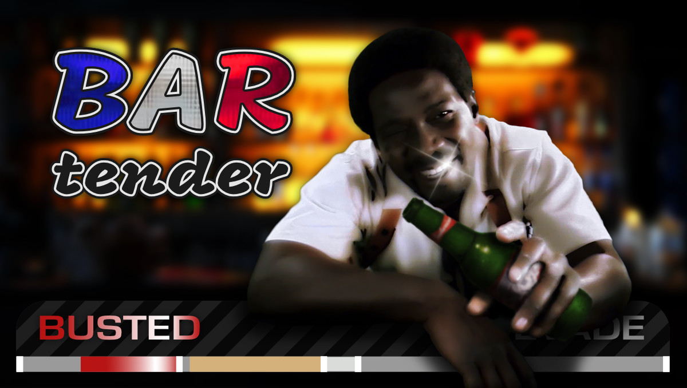

Bartender adds **new customisation options** for pursuits to *Need for Speed: Most Wanted* (2005). These new options come in two feature sets:
* the **"Basic" feature set** lets you change many otherwise hard-coded values of the game, and
* the **"Advanced" feature set** lets you [change cop-spawning behaviour and tables](https://youtu.be/4o4rhrwuMKU) without limits.

&nbsp;

Bartender's **default settings** match the vanilla game's, except for the bug / issue fixes. If those fixes are all you care about, then you don't need to configure Bartender at all.

&nbsp;

For **optimal customisability**, use [VltEd](https://nfs-tools.blogspot.com/2019/02/nfs-vlted-v46-released.html) along with Bartender. Bartender doesn't replace VltEd, as Bartender's features are deliberately limited to things you can't do with VltEd alone.

&nbsp;

The **sections below** address these questions in detail:
1. [What does the "Basic" feature set do?](#1---what-does-the-basic-feature-set-do)
2. [What does the "Advanced" feature set do?](#2---what-does-the-advanced-feature-set-do)
3. [How do I install Bartender for my game?](#3---how-do-i-install-bartender-for-my-game)
4. [Which mods are (in)compatible with Bartender?](#4---which-mods-are-incompatible-with-bartender)
5. [Which mods does Bartender depend on?](#5---which-mods-does-bartender-depend-on)
6. [How may I share or bundle Bartender?](#6---how-may-i-share-or-bundle-bartender)

&nbsp;

&nbsp;

&nbsp;

# 1 - What does the "Basic" feature set do?

The "Basic" feature set **lets you change** (per Heat level)
* whether patrol cops can start and join non-player pursuits,
* at what interval you gain passive bounty in active pursuits,
* the maximum combo-bounty multiplier for destroying cops quickly,
* how quickly and below what distance from the cops the red "BUSTED" bar can fill,
* how quickly the green "EVADE" bar fills when no cops can see the pursuit target,
* whether hiding spots make the pursuit target completely invisible to the cops,
* whether player-damaged cops are destroyed instantly if flipped over,
* when exactly (if at all) cops are destroyed regardless of damage if flipped over,
* when exactly (if at all) racers are automatically reset if flipped over,
* whether the Speedbreaker's vanilla recharging mechanics apply in pursuits,
* how much Speedbreaker charge you gain / lose from destroying any cop vehicle,
* which pursuit jurisdiction dispatch announces over the radio,
* which ground support the cops may request in non-player pursuits,
* the internal cooldown between non-Strategy roadblock requests,
* the internal cooldown between Heavy / LeaderStrategy requests,
* how far away roadblocks can spawn from the pursuit target,
* whether successful roadblock spawns cancel the current cop formation,
* when and to what extent (if at all) roadblock cops can join pursuits,
* whether roadblocks react to the pursuit target entering "COOLDOWN" mode,
* whether roadblocks react to the pursuit target hitting their spike strips,
* the maximum speed of scripted ramming attempts through HeavyStrategy 3,
* whether HeavyStrategy 3 requests interact with roadblock requests and spawns,
* which vehicles spawn in place of the ramming SUVs through HeavyStrategy 3,
* which vehicles spawn in place of the roadblock SUVs through HeavyStrategy 4,
* which vehicle spawns in place of Cross through LeaderStrategy 5, and
* which vehicles spawn in place of Cross and his henchmen through LeaderStrategy 7.

&nbsp;

The "Basic" feature set **also lets you change** (in general)
* whether specific cop vehicles are affected by pursuit-breaker instakills;
* which pursuit stats (e.g. length, bounty, infractions) the game tracks in races;
* how much Speedbreaker charge you gain / lose from destroying specific cop vehicles;
* what notification strings the game displays whenever you destroy specific cop vehicles;
* which notification icons the game displays whenever you destroy specific cop vehicles;
* which radio callsigns and chatter specific cop vehicles can trigger in your pursuits;
* under which conditions (if at all) specific cop vehicles can show up on the radar / mini-map;
* how (if at all) line of sight affects the colour of the helicopter cone-of-vision icon; and
* the selection, order, and length of interactive themes that play during your pursuits.

&nbsp;

The "Basic" feature set **always fixes fourteen bugs / issues** automatically:
* the game no longer fails to select certain arrest cutscenes,
* the game now always updates the passive-bounty increment after races,
* the (mini-)map icons for cops now always flash at their intended pace,
* transitions to Heat levels > 5 now trigger their proper radio announcements,
* the cops no longer announce each Heat level just once per game launch at most,
* the game now reads [VltEd](https://nfs-tools.blogspot.com/2019/02/nfs-vlted-v46-released.html) arrays correctly at each Blacklist rank and Heat level,
* cops joining pursuits from roadblocks no longer ignore all cop-related spawn limits,
* the helicopter mini-map icon is now always visible whenever a helicopter is active,
* the helicopter vision-cone icon now always disappears whenever a helicopter is destroyed,
* helicopters no longer cast static blob-shadows (like cars do) with incorrect placements,
* the cops are no longer inadvertently biased in how they select and make Strategy requests,
* Heat levels > 5 are no longer reset back to 5 whenever you enter free-roam or start an event,
* Heat levels > 5 are now shown correctly in menus (requires [Binary](https://github.com/SpeedReflect/Binary/releases) for missing textures), and
* the cops can no longer bust the pursuit target while their line of sight to it is broken.

&nbsp;

The "Basic" feature set **can fix three more bugs / issues**, depending on its configuration:
* the game no longer ignores VltEd settings for roadblocks and Strategies in races,
* HeavyStrategy 3 requests can no longer stall non-Strategy roadblock requests, and
* roadblock requests of any kind can no longer stall HeavyStrategy 3 requests.

&nbsp;

&nbsp;

&nbsp;

# 2 - What does the "Advanced" feature set do?

The "Advanced" feature set **lets you change** (per Heat level)
* which roadblock setups can spawn through roadblock requests,
* how likely the cops are to call out roadblock / spike spawns over the radio,
* how many chasing cops can (re)spawn regardless of the remaining engagement count,
* below what total number of active cops in the world the game can spawn new chasing cops,
* whether spawning decisions for chasing cops are independent of all other cops,
* whether spawning decisions for traffic cars are independent of those for cops,
* whether only destroyed chasing cops can decrement the remaining engagement count,
* whether Heat transitions immediately trigger backup to update the engagement count,
* how far away new chasing cops must spawn from all already active cops,
* above what count (if at all) no more cops can join the pursuit from roadblocks,
* when exactly (if at all) and how many cops that joined from roadblocks can flee,
* when exactly (if at all) and how many chasing cops from other Heat levels can flee,
* which vehicles (any amount, with counts and chances) can spawn to chase the pursuit target,
* which vehicles (same liberties as above) can spawn in non-Strategy roadblocks,
* which vehicles (ditto) can spawn as pre-generated cops in scripted events,
* which vehicles (ditto again) can spawn as free patrols outside pursuits,
* which vehicle spawns in place of the regular helicopter,
* when exactly (if at all) the helicopter can first spawn in your pursuits,
* when exactly (if at all) the helicopter can respawn upon running out of fuel,
* when exactly (if at all) the helicopter can respawn upon being destroyed,
* when exactly (if at all) the helicopter can respawn upon losing you,
* when exactly (if at all) the helicopter can rejoin instead upon losing you,
* when exactly (if at all) the helicopter can run out of fuel upon (re)spawning,
* how far away the helicopter can spawn to chase you,
* how far away the helicopter can spawn to search for you,
* whether the presence of roadblocks affects the helicopter's navigation behaviour,
* the internal cooldown between the helicopter's ramming attempts through HeliStrategy 2,
* below what pursuit-target speed HeavyStrategy 3 cops cancel their ramming attempts,
* how many cops can spawn through each successful HeavyStrategy 3 request,
* whether HeavyStrategy 3 cops can join the pursuit once their request expires,
* above what count (if at all) no more cops can join the pursuit from HeavyStrategy 3 requests,
* when exactly (if at all) and how many cops that joined from HeavyStrategy 3 requests can flee,
* when exactly (if at all) LeaderStrategy 5 / 7 Cross and / or his henchmen become aggressive,
* when exactly (if at all) the cops can request a new LeaderStrategy once Cross is gone,
* when exactly (if at all) the cops can request a new Strategy while another is still active,
* whether your Heat increases passively over time in active pursuits,
* how much Heat you gain / lose from cop and roadblock spawns,
* how much Heat you gain / lose from destroying any cop vehicle,
* how much Heat you gain / lose from colliding with other cars,
* how much Heat you gain / lose from assaulting any cop, and
* how much Heat you gain / lose from generic property damage.

&nbsp;

The "Advanced" feature set **also lets you change** (in general)
* how much Heat you gain / lose from destroying specific cop vehicles,
* what specific roadblock setups look like in terms of parts and their arrangement,
* how likely each roadblock setup is to spawn with horizontally mirrored parts instead, and
* which active non-chasing cops the engagement count shown above the pursuit board also tracks.

&nbsp;

The "Advanced" feature set **always fixes eleven bugs / issues** automatically:
* HeavyStrategy 4 roadblocks can now spawn with more than 4 vehicles,
* the cops no longer stop calling out roadblocks / spikes over the radio,
* failed roadblock spawn attempts can no longer stall spawns for chasing cops,
* Challenge Series races now use the Heat level limits defined for them in [VltEd](https://nfs-tools.blogspot.com/2019/02/nfs-vlted-v46-released.html),
* the game no longer ignores VltEd settings for roadblocks and Strategies in races,
* the Heat gauge no longer skips the transition animation for rapid Heat-level changes,
* the game now counts spike-strip deployments accurately in cost-to-state calculations,
* the game now counts support-vehicle deployments accurately in cost-to-state calculations,
* early Strategy despawns or cancellations no longer stall the cops from making new requests,
* the engagement count above the pursuit board now always tracks relevant cops accurately, and
* the pathfinding of new cops no longer breaks whenever a race pursuit transitions to free-roam.

&nbsp;

The "Advanced" feature set **can fix four more bugs / issues**, depending on its configuration:
* the cops no longer inadvertently fail to request four of the vanilla roadblock setups,
* the helicopter can no longer waste its spawns by losing the pursuit target nearly instantly,
* HeavyStrategy 3 cops no longer spawn in passive mode without trying to ram anything, and
* traffic spawns no longer slow down or stop at Heat levels with many cops or roadblocks.

&nbsp;

&nbsp;

&nbsp;

# 3 - How do I install Bartender for my game?

**Before installing** Bartender:
1. make sure your original copy of the game wasn't a repack or came pre-modified in any way,
2. read and understand the two sections about [mod (in)compatibilities](#4---which-mods-are-incompatible-with-bartender) and [dependencies](#5---which-mods-does-bartender-depend-on) below,
3. make sure your game's `speed.exe` is compatible (i.e. 5.75 MB / 6,029,312 bytes large), and
4. install an `.asi` loader or any mod with one (e.g. the [WideScreenFix](https://github.com/ThirteenAG/WidescreenFixesPack/releases/tag/nfsmw) mod by ThirteenAG).

&nbsp;

**To install** Bartender:
1. download and unzip the `NfSMW_Bartender_v3.06.0.7z` file from its [release page](https://github.com/rng-guy/NFSMWBartender/releases/latest);
2. if it doesn't exist already, create a `scripts` folder in your game's installation folder;
3. copy the `BartenderSettings` folder and `.asi` file to your game's `scripts` folder;
4. if Bartender's `.asi` file gets flagged by your antivirus software, whitelist the file; and
5. (optional) in User Mode of [Binary 2.8.3](https://github.com/SpeedReflect/Binary/releases/tag/v2.8.3) or newer, load and apply `FixMissingTextures.end`.

&nbsp;

**After installing** Bartender: 
1. edit the configuration (`.ini`) files in the `BartenderSettings` folder to your liking; and
2. if you encounter any issues or want more feature details, see the [appendix file](APPENDIX.md).

&nbsp;

**To uninstall** Bartender, remove its files from your game's `scripts` folder. There's no need to remove the optional missing textures, as the game doesn't use them without Bartender.

&nbsp;

**To update** Bartender, uninstall it and repeat the installation process above. If you update from a version older than v3.06.00, replace all old configuration files.

&nbsp;

&nbsp;

&nbsp;

# 4 - Which mods are (in)compatible with Bartender?

Almost all **[VltEd](https://nfs-tools.blogspot.com/2019/02/nfs-vlted-v46-released.html) and [Binary](https://github.com/SpeedReflect/Binary/releases) mods** should be fully compatible with all Bartender configurations. 

&nbsp;

Bartender's **"Basic" feature set** changes the way the game accesses some VltEd arrays:
* In `pursuitlevels`, `0x80deb840` now uses the correct value at each Blacklist rank.
* In `aivehicle`, `RepPointsForDestroying` now uses the correct value at each Heat level.

&nbsp;

Bartender's **"Advanced" feature set** forces the game to no longer ignore the roadblock-related `pursuitlevels` and the Strategy-related `pursuitsupport` VltEd settings in race pursuits. The feature set also replaces four specific `pursuitlevels` parameters in all pursuits:
* the `cops` array,
* `HeliFuelTime`,
* `TimeBetweenHeliActive`, and
* `SearchModeHeliSpawnChance`.

&nbsp;

Most **other `.asi` mods** should be fully compatible with all Bartender configurations. However, some pursuit-related .asi mods require manual (re)configuration for compatibility:
* For [NFSMW LimitAdjuster](https://zolika1351.pages.dev/mods/nfsmwlimitadjuster) by Zolika1351, see the [section about dependencies](#5---which-mods-does-bartender-depend-on) below.
* For [XNFSMusicPlayer](https://github.com/xan1242/XNFSMusicPlayer/releases) by xan1242, delete Bartender's `[Music:Playlist]` settings.
* In [NFSMW Unlimiter](https://github.com/nlgxzef/NFSMWUnlimiter/releases) by nlgxzef, disable `EnableCopDestroyedStringHook`.
* In [NFSMW ExtraOptions](https://github.com/ExOptsTeam/NFSMWExOpts/releases) by ExOptsTeam, disable `HeatLevelOverride`, `PursuitActionMode`, and `ZeroBountyFix`.

&nbsp;

&nbsp;

&nbsp;

# 5 - Which mods does Bartender depend on?

Under certain conditions, Bartender **may require** a mod that replaces the game's car loader. There are two such mods: [NFSMW LimitAdjuster](https://zolika1351.pages.dev/mods/nfsmwlimitadjuster) by Zolika1351, and [OpenLimitAdjuster](https://github.com/gaycoderprincess/MostWantedOpenLimitAdjuster) by Chloe. You likely need one of these two mods if you configure Bartender in any of the following ways:
* cop-vehicle spawn tables in `CarTables.ini` : You define > 3 vehicle types for any Heat level.
* `[Chasers:Limits]` in `CarSpawns.ini`: You define a global cop-spawn limit > 8.
* `[Chasers:Independence]` in `CarSpawns.ini`: You enable independent spawns for chasing cops.
* `[Traffic:Independence]` in `CarSpawns.ini`: You enable independent spawns for traffic cars.
* `[Heavy3:Count]` in `Strategies.ini`: You define a vehicle count > 2 per request.
* `[Heavy3:Joining]` in `Strategies.ini`: You enable joining from HeavyStrategy 3.
* `[Heavy3:Unblocking]` in `Strategies.ini`: You define any unblock delays.

&nbsp;

**Should you install** any car-loader replacement mod, you may need to re-configure other mods:
* In [NFSMW Unlimiter](https://github.com/nlgxzef/NFSMWUnlimiter/releases) by nlgxzef, disable `ExpandMemoryPools` and `RandomizeTraffic`.
* In [NFSMW ExtraOptions](https://github.com/ExOptsTeam/NFSMWExOpts/releases) by ExOptsTeam, disable `ExpandMemoryPools` and `DoScreenPrintf`.
* In [NFSMW HDReflections](https://github.com/AeroWidescreen/NFSHDReflections) by Aero, disable `ExpandMemoryPools`.

&nbsp;
 
**Should you install** NFSMW LimitAdjuster, you also need to configure it to work with Bartender:
1. place `NFSMWLimitAdjuster.asi` / `.ini` into the same folder as `speed.exe` (not `scripts`);
2. under `[Options]` in `NFSMWLimitAdjuster.ini`, disable every cop-related feature;
3. under `[Limits]` in `NFSMWLimitAdjuster.ini`, set `TrafficCars` to 50 (or higher), `PursuitCops` to 255, and `Vehicles_SoftCap` to 255.

&nbsp;

&nbsp;

&nbsp;

# 6 - How may I share or bundle Bartender?

You are free to bundle Bartender and its files with your own pursuit mod, **no credit required**. In the interest of code transparency, however, consider linking to [Bartender's GitHub repository](https://github.com/rng-guy/NFSMWBartender) somewhere in your mod's documentation (e.g. README).

&nbsp;

Finally, Bartender wouldn't have seen the light of day without
* **DarkByte**, for [Cheat Engine](https://www.cheatengine.org/);
* **[rx](https://github.com/rxyyy)**, for encouraging me to try `.asi` modding;
* **GuidedHacking**, for their [Cheat Engine tutorials](https://www.youtube.com/playlist?list=PLt9cUwGw6CYFSoQHsf9b12kHWLdgYRhmQ);
* **[nlgxzef](https://github.com/nlgxzef)**, for his (partial) Most Wanted debug symbols;
* **[ExOptsTeam](https://github.com/ExOptsTeam)**, for permitting me to use their Heat-level fixes;
* **Sebastiano Vigna**, for his [pseudorandom number generators](https://prng.di.unimi.it/);
* **trelbutate**, for his [NFSMW Cop Car Healthbars](https://github.com/trelbutate/MWHealthbars/) mod as a learning resource; and
* **[Orsal](https://nfsmods.xyz/usermods/20407)**, **zeta1207**, **[Aven](https://nfsmods.xyz/usermods/1610)**, **Astra King79**, and **[MORELLO](https://nfsmods.xyz/usermods/6960)**, for testing and providing feedback.